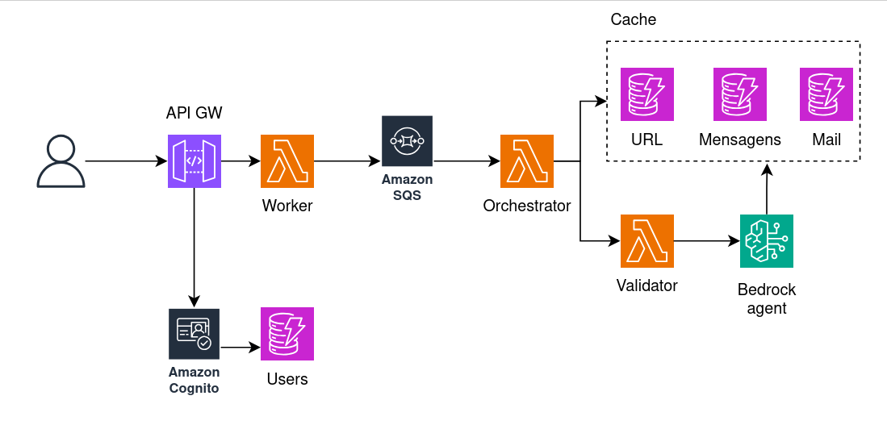

# Risk Assistant — AI-Powered Threat Analysis Platform

Internet security is no longer the same it was before AI. Scamming has become dramatically easier, cyberattacks increase severely every year, and 80% of scammed people never recover their money.

**Risk Assistant** is a serverless AWS cloud infrastructure built during a local hackathon to address this. It analyzes content — URLs, messages, and images — and returns an AI-generated risk score from 0 to 100, a decision (`allow` / `review` / `block`), and a plain-language explanation the user can act on.

---

## How It Works

A user submits content through a mobile app, browser extension, or web client. The backend queues the request, runs it through Amazon Bedrock (Mistral Mixtral 8x7B), and returns a structured risk report. Results are cached to avoid redundant AI calls. Images are handled via a separate pipeline using Textract and Rekognition to extract text before scoring.

The core output from every analysis:

```json
{
  "score": 87,
  "decision": "block",
  "category": "phishing",
  "confidence": "high",
  "triggers": ["brand_impersonation", "credential_collection", "suspicious_domain"],
  "summary": "This link mimics a legitimate login page to harvest credentials.",
  "simple_explanation": "This looks unsafe — it may steal your login details.",
  "safe_next_step": "Open the official app instead.",
  "recommended_action": "Do not enter personal information on this website.",
  "generated_at": "2026-05-23T15:42:10Z"
}
```

---

## Architecture

Fully serverless, event-driven, deployed on AWS with Terraform.

<p align="center">
  
</p>

### Lambda Functions

| Function | Runtime | Role |
|---|---|---|
| **Orchestrator** | Python 3.12 | API entry point. Validates requests, checks cache, creates jobs, enqueues to SQS or calls Validator directly |
| **Worker** | Python 3.12 | SQS consumer (batch size 10). Checks cache, calls Validator, writes results |
| **Validator** | Python 3.12 | AI layer. Invokes Bedrock Agent; falls back to direct model call on failure |
| **Image Worker** | Python 3.12 | S3 event consumer. Uses Textract + Rekognition to extract text from images, then calls Validator |

### API Endpoints

All endpoints require a valid Cognito JWT in the `Authorization` header.

| Method | Path | Description |
|---|---|---|
| `POST` | `/analyze` | Submit a URL, message, or other text content |
| `GET` | `/result/{jobId}` | Poll for an async job result |
| `GET` | `/history` | Fetch past analyses for the authenticated user |
| `POST` | `/image/upload-url` | Get a presigned S3 URL to upload an image for analysis |

### DynamoDB Tables

| Table | Key | Purpose |
|---|---|---|
| `users` | `userId` | User profiles |
| `devices` | `deviceId` (GSI: `userId`) | Registered devices per user |
| `parental-control` | `userId` | Per-user risk sensitivity settings (`low` / `medium` / `high`) |
| `url-cache` | `urlHash` + TTL | Cached results for URL inputs |
| `content-cache` | `contentHash` + TTL | Cached results for message/text inputs |
| `analysis-jobs` | `userId` + `jobId` + TTL | Async job state and results |

### Caching

Every result is stored against a hash of the input content. Before calling Bedrock, both the Orchestrator and Worker check the cache. Cache entries expire via DynamoDB TTL. When the model or prompts change, bump the `CACHE_VERSION` environment variable on the Worker to invalidate all existing entries without touching the database.

### AI Agent

A Bedrock Agent (`risk-summary`) backed by Mistral Mixtral 8x7B. Its system prompt instructs it to act as a security analyst and return a strictly structured JSON response. It adapts the strictness of its decision based on the user's `riskSensitivity` setting from the parental control table:

- URL input → focuses on link/domain risk
- Email address → focuses on impersonation risk  
- Message → focuses on social engineering risk
- Image → text extracted first, then the same logic applies

The Validator Lambda holds the agent ID/alias and falls back to a direct `InvokeModel` call if the agent invocation fails.

---

## Project Structure

```
risk_assistant/
├── terraform/           # IaC — all AWS resources
│   ├── main.tf          # Provider and locals
│   ├── api.tf           # Cognito + API Gateway
│   ├── compute.tf       # Lambda functions
│   ├── database.tf      # DynamoDB tables
│   ├── queue.tf         # SQS queues
│   ├── bedrock.tf       # Bedrock Agent
│   ├── image.tf         # S3 image bucket + notifications
│   ├── iam.tf           # IAM roles and policies
│   ├── billing.tf       # CloudWatch billing alarm
│   ├── variables.tf
│   ├── outputs.tf
│   └── terraform.tfvars.example
├── lambda/
│   ├── orchestrator/    # API handler
│   ├── worker/          # SQS consumer
│   ├── validator/       # Bedrock AI layer
│   └── image_worker/    # S3 image pipeline
└── docs/
    └── data-model.md    # DynamoDB table schemas and example items
```

---

## Deployment

### Prerequisites

- AWS CLI authenticated with sufficient permissions
- Terraform ≥ 1.5
- Python 3.12+ (Lambda runtime; also used locally for packaging)
- Bedrock model access enabled in your account for the chosen model

### 1. Configure variables

```bash
cp terraform/terraform.tfvars.example terraform/terraform.tfvars
```

Edit `terraform.tfvars`:

```hcl
aws_region          = "eu-west-1"
project             = "devunleashed"
env                 = "dev"
bedrock_model_id    = "mistral.mixtral-8x7b-instruct-v0:1"
web_callback_url    = "https://<YOUR_EXT_ID>.chromiumapp.org/"
web_logout_url      = "https://<YOUR_EXT_ID>.chromiumapp.org/"
billing_alert_email = "you@example.com"
billing_threshold   = "3"
```

> **Bedrock model access:** Go to AWS Console → Bedrock → Model access and enable the model for your account and region before deploying.

### 2. Deploy

```bash
cd terraform
terraform init
terraform plan
terraform apply
```

Terraform outputs the API Gateway URL and all Cognito client IDs needed to configure your clients.

### 3. Create a test user

```bash
aws cognito-idp sign-up \
  --client-id <cognito_cli_test_client_id> \
  --username you@example.com \
  --password "YourPassword1!" \
  --region eu-west-1

aws cognito-idp admin-confirm-sign-up \
  --user-pool-id <cognito_user_pool_id> \
  --username you@example.com \
  --region eu-west-1
```

### 4. Get a token and call the API

```bash
TOKEN=$(aws cognito-idp initiate-auth \
  --auth-flow USER_PASSWORD_AUTH \
  --client-id <cognito_cli_test_client_id> \
  --auth-parameters USERNAME=you@example.com,PASSWORD="YourPassword1!" \
  --region eu-west-1 \
  --query 'AuthenticationResult.IdToken' \
  --output text)

curl -X POST https://<api_gateway_url>/dev/analyze \
  -H "Authorization: Bearer $TOKEN" \
  -H "Content-Type: application/json" \
  -d '{"content": "https://suspicious-login-page.com", "type": "url"}'
```

The response includes a `jobId`. Poll for the result:

```bash
curl https://<api_gateway_url>/dev/result/<jobId> \
  -H "Authorization: Bearer $TOKEN"
```

---

## Authentication

Three Cognito app clients are provisioned:

| Client | Flow | Use case |
|---|---|---|
| `mobile` | SRP + password | Native mobile app |
| `web` | OAuth2 PKCE (code flow) | Browser extension / web UI |
| `cli-test` | Password | Local development and testing |

---

## Teardown

```bash
cd terraform
terraform destroy
```

This will remove all provisioned resources. The S3 image bucket has `force_destroy = true` so it will be deleted even if it contains objects.

---

## Data Model

See [`docs/data-model.md`](docs/data-model.md) for full DynamoDB table schemas and example item shapes.
